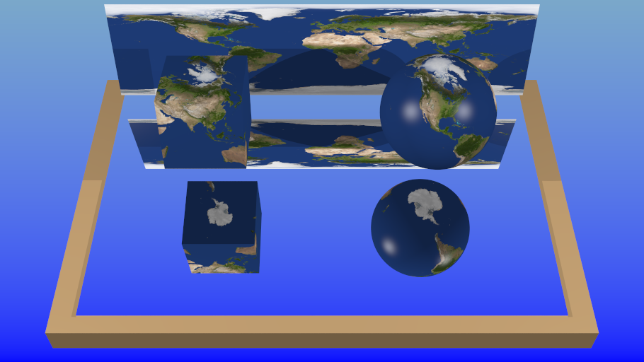
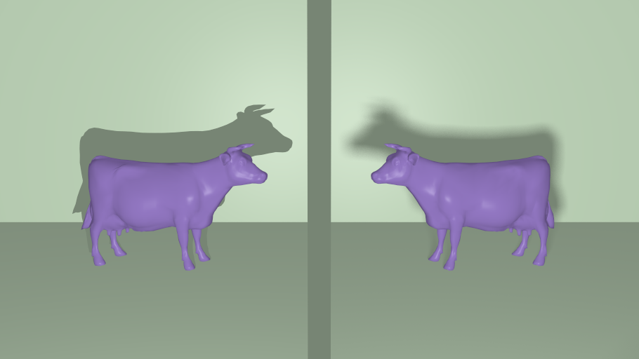
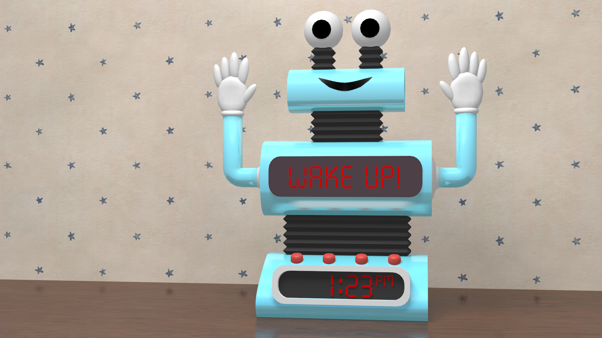

# portrayer

This ray tracer is called "portrayer". There are two main reasons for this:

1. It "portrays" 3D objects.
2. The name "portrayer" has the word "ray" in it.

## Features

The following sections highlight just some of the features of this ray tracer.

### Many supported primitives

You can render many different types of primitives:

* Planes
* Cubes
* Spheres
* Cylinders
* Cones
* Triangles
* Triangle Meshes

Certain features like texture mapping and normal mapping are limited to only
certain primitives.


### Hierarchical Scenes & Instancing

When building bigger scenes, it is often useful to be able to build the scene
hierarchically. This allows you to manipulate groups of scene nodes and avoid
having to constantly update large numbers of nodes.

Hierarchical scenes also enable a form of reuse called "instancing". This is
where you take the same node (or group of nodes) and create "copies" of it
throughout the scene using multiple parent nodes. All of the nodes point to the
same data, but having multiple parents makes it seem like many copies have been
made.

A great example of this is in the castle scene above. Each of those trees is
actually just a single group of nodes representing one tree. We created a group
of nodes to represent that tree and then "instanced" it around the scene using
many parent nodes in order to create the forest.

### Mirror Reflection

Use the `reflectivity` material property to create reflective surfaces.

```rust
let mat_mirror = Arc::new(Material {
    diffuse: Rgb {r: 0.0, g: 0.0, b: 0.0},
    specular: Rgb {r: 0.8, g: 0.8, b: 0.8},
    shininess: 1000.0,
    reflectivity: 1.0,
    ..Material::default()
});
```


### Smooth/Phong Shading

Meshes can be "flat" shaded or "smooth" shaded (aka "phong" shaded).


This is just a shading trick. The mesh geometry is not actually modified to make
anything smoother. You can tell by looking at the edges and seeing that they are
still completely flat even though the faces themselves look smoother.

### Antialiasing (not adaptive)

Casting only a single ray per pixel actually turns out to be a fairly crude
approximation. This gives you images that look very low resolution and have all
kinds of visual artifacts (e.g. "jaggies" or jagged lines).

We support the antialiasing technique known as "random sampling". This is a
fairly easy to implement sampling technique that produces results somewhere
between uniform sampling and jittering.


You can customize the number of samples used to render an image using the
`SAMPLES` environment variable.

### Texture Mapping

Spheres, cubes, planes, and meshes can be texture mapped. Texture coordinates
for meshes are read from the mesh OBJ file. Values outside the range of 0.0 to
1.0 will be wrapped around, creating a repeated/tiled effect.

```rust
let earth = Arc::new(Texture::from(ImageTexture::open("assets/earth.jpg")?));
let mat_tex = Arc::new(Material {
    diffuse: Rgb {r: 0.506, g: 0.78, b: 0.518},
    specular: Rgb {r: 0.5, g: 0.5, b: 0.5},
    shininess: 25.0,
    texture: Some(earth),
    ..Material::default()
});
```

Spheres are mapped using spherical coordinates, cubes are mapped using cube
mapping, and planes are mapped using a simple plane mapping.




You can customize the UV mapping on each scene node using the `uv_trans`
material property:

```rust
let wallpaper = Arc::new(Texture::from(ImageTexture::open("assets/robot-alarm-clock/wallpaper.jpg")?));
let mat_wall = Arc::new(Material {
    // diffuse comes from texture
    specular: Rgb {r: 0.3, g: 0.3, b: 0.3},
    shininess: 25.0,
    texture: Some(wallpaper),
    uv_trans: Mat3::scaling_3d(3.0),
    ..Material::default()
});
```

### Normal Mapping

Spheres, cubes, planes, and meshes can be normal mapped. Like Phong shading,
this is just a shading trick. The actual geometry of the primitive is not
modified. Instead, its normals are perturbed based on the normals loaded from
the normal map.

```rust
let tex_map_sphere = Arc::new(Texture::from(ImageTexture::open("assets/Rock_033_baseColor_2.jpg")?));
let norm_map_sphere = Arc::new(NormalMap::open("assets/Rock_033_normal_2.jpg")?);
let mat_tex_sphere_norm = Arc::new(Material {
    diffuse: Rgb {r: 0.37168, g: 0.236767, b: 0.692066},
    specular: Rgb {r: 0.6, g: 0.6, b: 0.6},
    shininess: 25.0,
    texture: Some(tex_map_sphere),
    normals: Some(norm_map_sphere),
    ..Material::default()
});
```

For a primitive to support normal mapping, it must support texture mapping and
also provide a transformation matrix that is applied to the normals loaded from
the normal map.


This image uses the following textures and normal maps:

| Texture | Normal Map |
| ------- | ---------- |
|  |  |
|  |  |
|  |  |

### Transmission / Refraction

In addition to mirror reflection, you may also use transmission / refraction to
create transparent materials like water and glass.

```rust
let mat_water = Arc::new(Material {
    diffuse: Rgb {r: 0.0, g: 0.0, b: 0.1},
    specular: Rgb {r: 0.3, g: 0.3, b: 0.3},
    shininess: 25.0,
    reflectivity: 0.9,
    refraction_index: WATER_REFRACTION_INDEX,
    ..Material::default()
});
```


### Glossy Reflection

Most objects are not perfectly reflective. Instead, the reflection appears a
little bit "glossy" or blurred. This can be simulated by randomly perturbing the
reflection ray within a certain rectangle perpendicular to the reflection ray.
The `glossy_side_length` property sets the size of this rectangle.

```rust
let glossy_ball = Arc::new(Material {
    diffuse: Rgb {r: 0.146505, g: 0.314666, b: 0.170564},
    specular: Rgb {r: 0.3, g: 0.3, b: 0.3},
    shininess: 100.0,
    reflectivity: 0.4,
    // This is what creates the glossy effect!
    glossy_side_length: 2.0,
    ..Material::default()
});
```

The ball on the right has glossy reflection enabled:


Make sure you render with a high number of samples (see Antialiasing).

### Soft Shadows

By default, lights are treated as infinitesimally small points. This doesn't
reflect reality though, especially for scenes that take place within a room.
You should instead try to use an "area light" that models the light as a
parallelogram. Using a non-zero area for the light creates a visible umbra and
penumbra in the shadow.

This scene is rendered as a single image. A cube divides the scene down the
middle. On the left, a point light is used and on the right an area light is
used.



```rust
lights: vec![
    // Left - Point Light
    Light {
        position: Vec3 {x: -2.0, y: 2.0, z: 16.0},
        color: Rgb {r: 0.5, g: 0.5, b: 0.5},
        ..Light::default()
    },

    // Right - Area Light
    Light {
        position: Vec3 {x: 2.0, y: 2.0, z: 16.0},
        color: Rgb {r: 0.5, g: 0.5, b: 0.5},
        area: Parallelogram {
            a: Vec3 {x: 0.0, y: 0.5, z: 0.0},
            b: Vec3 {x: 0.5, y: 0.0, z: 0.0},
        },
        ..Light::default()
    },
],
```

Make sure you render with a high number of samples (see Antialiasing).

### Accelerating Rendering

A k-d tree has been implemented to speed up rendering scenes with a lot of
objects. Using a k-d tree to partition the scene reduces the number of objects
that need to be checked for intersection with the ray. The current implementation
is occassionally buggy, so do watch out for that if you plan to use it. You can
activate this optimization using the `kdtree` feature. See the Conditional
Compilation section below for more information.


## Rendered Images

For even more images, run the examples in the `examples/` directory.

### Andy the Alarm Clock



## Creating & Rendering Scenes

The ray tracer uses Rust programs for input. The easiest way to create these is
to create a file in the `examples/` directory ending with the `.rs` file
extension. Each example file (e.g. `examples/foo.rs`) can then be run using
the command:

    $ cargo run --release --example foo

This command must be run in the root directory of the project. That is the
directory containing the `Cargo.toml` file. The `--release` flag is important in
order to get maximum performance from the ray tracer.

To see a list of available example programs, run:

    $ cargo run --release --example

Each of these "example" scripts use the ray tracer as a library. This gives them
complete access to the Rust programming language and its various facilities.
That means that you can define functions, modules, structures, and anything else
you may need to create your scene. You also get access to the full linear
algebra library used to implement the ray tracer as well as other libraries for
things like random number generation.

Since each script just uses the ray tracer as a library, there is no
command-line interface/tool for the ray tracer itself. You just run the Rust
program that uses the ray tracer library and it generates images for you. This
approach ended up being both extremely flexible and very easy to extend. The ray
tracer can be used in all kinds of ways without modifying the core ray tracing
facilities.

The provided interface is described in more detail below.

## The Input Format

To be able to create scenes using Rust, you need to have a good understanding of
the Rust programming language. The Rust book is a great resource for this and I
highly recommend reading it to help you get started: https://doc.rust-lang.org/book/

The high-level structure of a Rust program that uses this ray tracer is as
follows:

```rust
// 1. Import types and functions from portrayer and the standard library

// 2. Define the main entry point of the program, declaring explicitly that
//    certain errors may occur
fn main() -> Result<(), Box<dyn Error>> {
    // 3. Define materials, load meshes, create scene nodes, etc.

    // 4. Define the scene
    let scene = HierScene {
        root: /* the root node of the scene */,

        lights: /* a list of lights to use when rendering the scene */,

        ambient: /* the ambient light present in the scene */,
    };

    // 5. Define the camera
    let cam = CameraSettings {
        eye: /* position of the camera in world space */,
        center: /* position that the camera is pointing to in world space */,
        up: /* the "up" direction of the camera, usually (0,1,0) */,
        fovy: /* the vertical field-of-view angle in radians */,
    };

    // 6. Create/load an image ("mut" makes it so we can write to the image)
    let mut image = Image::new("mycoolimage.png", 256, 256)?;

    // 7. Render the scene created above
    image.render::<RenderProgress, _>( // "RenderProgress" shows a progress bar
        &scene, // providing the scene defined above
        cam, // providing the camera defined above
        // providing a background gradient defined as a closure/lambda
        |uv: Uv| Rgb {r: 0.2, g: 0.4, b: 0.6} * (1.0 - uv.v) + Rgb::blue() * uv.v,
    );

    // 8. Write the rendered image to the filename specified above and propagate
    //    any I/O errors that occur
    Ok(image.save()?)
}
```

Every example in the `examples/` directory is structured like this. For complete
demonstrations of each of these steps, see those files.

By passing "mycoolimage.png" to `Image::new`, you instruct the program to write
the image to a file called "mycoolimage.png" in the directory that the program
is invoked in. That means that if you invoked the `cargo run` command in the
`/home/coolbeans/portrayer` directory, you'll get a file called
`/home/coolbeans/portrayer/mycoolimage.png`. This image can then be opened using
the image viewer on your computer.

Much like the output path, any paths to assets are relative to the current
directory as well. That means that if an example program references
`assets/foo.png` and `cargo run` is invoked from the `/home/coolbeans/portrayer`
directory, it will attempt to load `/home/coolbeans/portrayer/assets/foo.png`.

## Conditional Compilation

Certain features require additional command line arguments to be passed to
`cargo run` in order to be used. Cargo allows you to do this using something
called "cargo features". These enable different "features" of a Rust library.
(It's not the best name, but it gets the job done.)

Here are some examples:

* `cargo run --release --example big-scene --features kdtree`
    This will run the `examples/big-scene.rs` file with the k-d tree feature
    enabled. Enabling this feature is necessary for bigger scenes to run quickly.
* `cargo run --release --example macho-cows --features render_bounding_volumes`
    With this feature enabled, meshes will render as cubes (their bounding
    volumes). This is useful for debugging.
* `cargo run --release --example big-scene --features flat_scene`
    Before scenes are turned into a k-d tree, the entire scene hierarchy is
    flattened. This renders the scene with the flattened hierarchy. This does
    not generally provide any real performance boost on its own, but it can
    help with debugging from time to time.

All of the features of this renderer are listed in the `Cargo.toml` file under
the `[features]` table.

## Environment variables

While there is no command-line interface for the renderer, it can be useful to
tweak certain parameters without having to recompile the entire program. These
are set using environment variables.

* `SAMPLES=150` - This will instruct the renderer to take 150 samples for each
  pixel and then average them (antialiasing). The more samples, the slower the
  render. By default, the renderer will take 100 samples.
* `KD_DEPTH=18` - This will instruct the k-d tree to limit its depth to 2^18
  nodes. By default, the renderer is limited to 2^10 k-d tree nodes. Increasing
  that number can speed up scenes with lots of nodes (at the cost of using
  more memory).
* `KD_MESH_DEPTH=18` - This will allow meshes that use the k-d tree as their
  underlying storage to create trees with up to 2^18 nodes. This can be useful
  for particularly large meshes. By default the renderer will limit the tree to
  2^10 nodes. This is sufficient for most simple meshes.

A full invocation of the ray tracer with some of these variables used may
look like:

    time SAMPLES=100 KD_DEPTH=18 cargo run --release --example big-scene --features kdtree

The `time` command is of course optional but definitely recommended to see how
much time you're saving with all of these features!

## Acknowledgements

See the `README.md` file in the `assets/` directory for full attribution for all
textures and models acquired from external sources. The images created with this
project wouldn't be possible without the excellent free and personal-use
textures and models available online.
